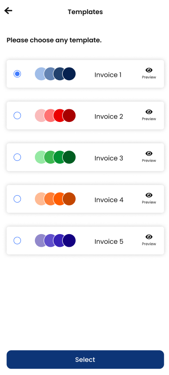
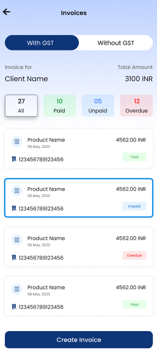
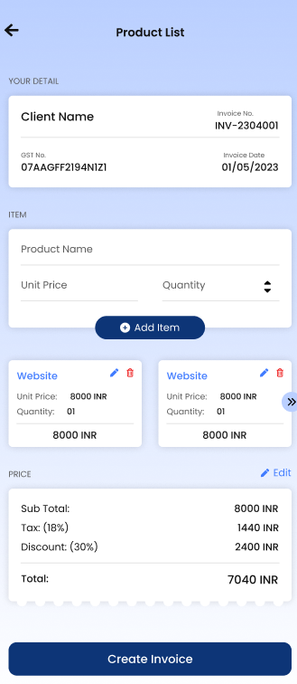
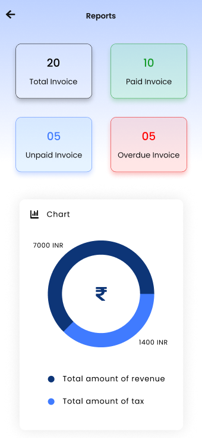

# Intelligent Billing System(IBS)
Welcome to the official repository of Intelligent Billing System, a robust and efficient tool designed to streamline and automate the billing process. This repository contains the documentation for the Intelligent Billing System(IBS) application.

## About 

IBS is built to handle various billing scenarios with intelligence, ensuring accuracy and efficiency. This application can be easily integrated into different business environments, providing seamless and error-free billing solutions.

## Features 
Automated Billing: Automatically generates bills based on predefined rules and inputs.  
Customizable Templates: Allows for the creation of custom billing templates to fit different business needs.  
Tax Calculations: Includes support for various tax systems and can automatically apply taxes where applicable.  
User Management: Supports multiple user roles with different access levels.  
Secure and Compliant: Ensures data security and compliance with industry standards.  

## Technologies Used
Front-End: Flutter,Dart  
Back-End: PHP,Laravel  
Database: MySQL  

## Screenshots

## Contact 

For any inquiries or support, please contact at:

Email: dhairyadesai230@divyachem.com
